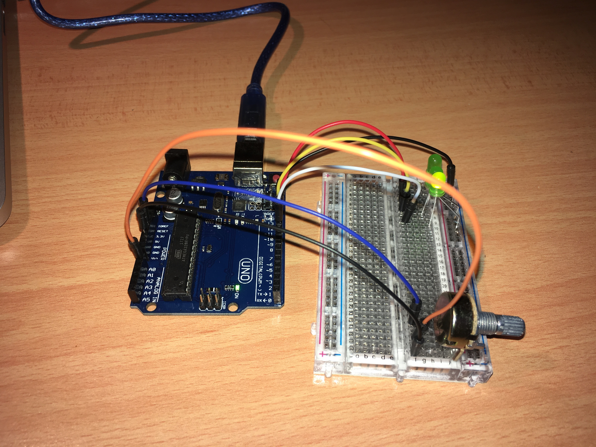
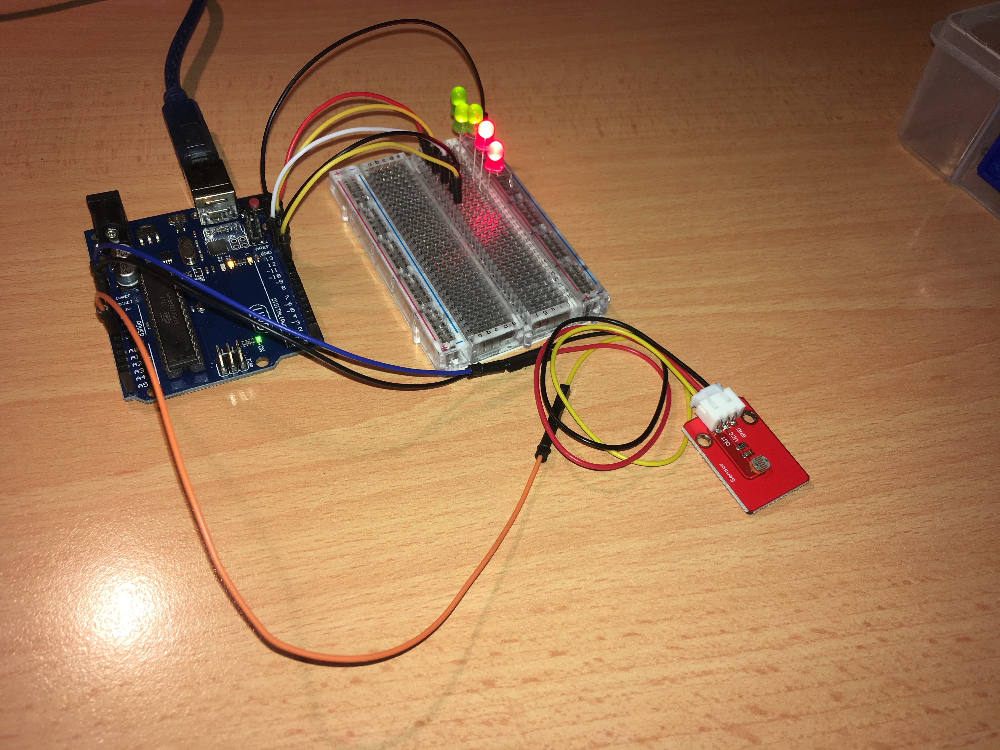

# Arduino Sandbox

My playground for learning about Arduino.

## potentiometer_delay_lights

Control the speed of a cycling set of LEDs by turning a knob.

## ldr_light_meter

Plug in a light-dependent resistor and a bunch of LEDs and measure your light level.

